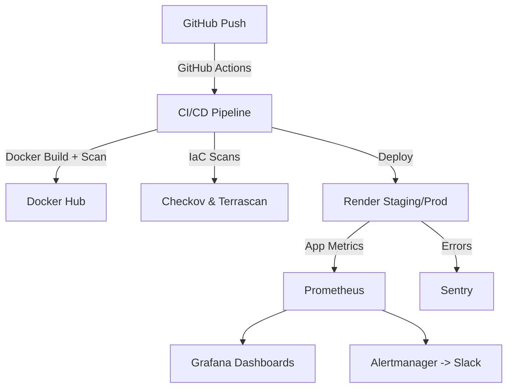

# 🚀 FullStack DevSecOps Demo

A production-grade fullstack pipeline showcasing modern DevSecOps practices — from secure CI/CD to observability and Infrastructure-as-Code (IaC). This project demonstrates how to take a simple Node.js/Express app and wrap it with a battle-tested DevSecOps workflow used in real companies.

## 🌟 Highlights

- **CI/CD Pipeline**: GitHub Actions with linting, testing, dependency audits, Docker builds, Trivy scans, Gitleaks, CodeQL, Checkov & Terrascan
- **Secure Containerization**: Hardened Dockerfiles with non-root users and HEALTHCHECK instructions
- **Runtime Security**: Gitleaks (secret scanning), CodeQL (static analysis), npm audit (dependency vulnerabilities)
- **Observability Stack**:
  - Prometheus for metrics collection
  - Grafana dashboards (CPU %, memory, HTTP request rates, error rate, latency)
  - Alertmanager + Slack for real-time alerts
  - Sentry for application-level error monitoring and release tracking
- **Environments**:
  - Staging: auto-deploy on `develop`
  - Production: auto-deploy on `main`
- **IaC Versioning**: Full `render.yaml` and Helm manifests for portability to Kubernetes (k3s, GKE, EKS)

## 🏗️ Architecture



🔄 CI/CD Workflow

Key stages from .github/workflows/cicd.yml:

Lint & Test

ESLint for code quality

Jest for unit tests

Security Scans

npm audit

Trivy (container vulnerabilities)

Gitleaks (secrets)

CodeQL (static analysis)

Checkov + Terrascan (IaC security)

Build & Push

Docker image pushed to Docker Hub with commit + latest tags

Deploy

Render Staging (branch: develop)

Render Prod (branch: main)

Automatic Sentry release tracking

Notify

Slack messages for staging/prod deployments with build status

📊 Observability

Prometheus

Scrapes app /metrics endpoint (via prom-client)

Collects:

Default Node.js process metrics

http_requests_total counter

Latency histogram

Grafana

Preprovisioned dashboards:

CPU %

Memory usage

HTTP requests/sec

5xx error rate

95th percentile latency

Alertmanager

Sends alerts to Slack via webhook

Starter rules:

CPU > 80% for 2 minutes

Error rate > 5% over 5 minutes

Sentry

Captures unhandled exceptions

Tied to GitHub Actions release versions

Shows "Deployed to Staging/Prod" in release timeline

🐳 Docker Hardening

All service images include:

HEALTHCHECK instructions

Non-root user execution

Minimal base images (node:18-alpine, alpine:3.20, etc.)

☸️ Kubernetes (Future-Ready)

Helm charts included for:

myapp (Node.js/Express)

Prometheus

Grafana

Alertmanager

Supports secrets via K8s Secret resources (e.g. Slack webhook, Grafana admin password).

Designed for deployment on:

Local dev: k3s / kind

Cloud: GKE, EKS, AKS

⚡ Quick Start (Render)

Fork this repo

Set secrets in GitHub Actions:

DOCKERHUB_USERNAME / DOCKERHUB_TOKEN

RENDER_API_KEY, RENDER_SERVICE_ID, RENDER_SERVICE_ID_PROD

SENTRY_AUTH_TOKEN, SENTRY_ORG, SENTRY_PROJECT

SLACK_WEBHOOK_URL

Push to develop → staging deploy

Merge to main → production deploy

📂 Repository Structure

```
├── src/                    # Node.js app (Express + Sentry + Prometheus metrics)
├── infra/                  # Infra services
│   ├── prometheus/
│   ├── grafana/
│   └── alertmanager/
├── helm/                   # Helm charts for k8s migration
├── .github/workflows/      # CI/CD pipelines
├── render.yaml             # Render IaC config
└── Dockerfile              # App Dockerfile

```
🎯 Why This Matters

Feature	Benefit

Full DevSecOps pipeline	Not just CI/CD, but integrated security, monitoring, and alerting

Cloud-native ready	Helm charts → easy migration to Kubernetes

Production realism	Covers error tracking, observability, secrets management, IaC scanning

Team collaboration	Slack notifications + Sentry releases → transparent deployments

Hands-on expertise	End-to-end experience across modern DevSecOps toolchain


This repo serves as my portfolio centerpiece: a showcase of how I'd run secure, observable, cloud-ready software delivery in a real engineering organization.

📬 Contact

Interested in how I can bring end-to-end DevSecOps expertise to your team? Let's connect!

<div align="center">

Built with ❤️ to demonstrate modern DevSecOps practices

https://img.shields.io/github/stars/yourusername/fullstack-devsecops-demo?style=social
https://img.shields.io/badge/License-MIT-blue.svg

</div> ```

