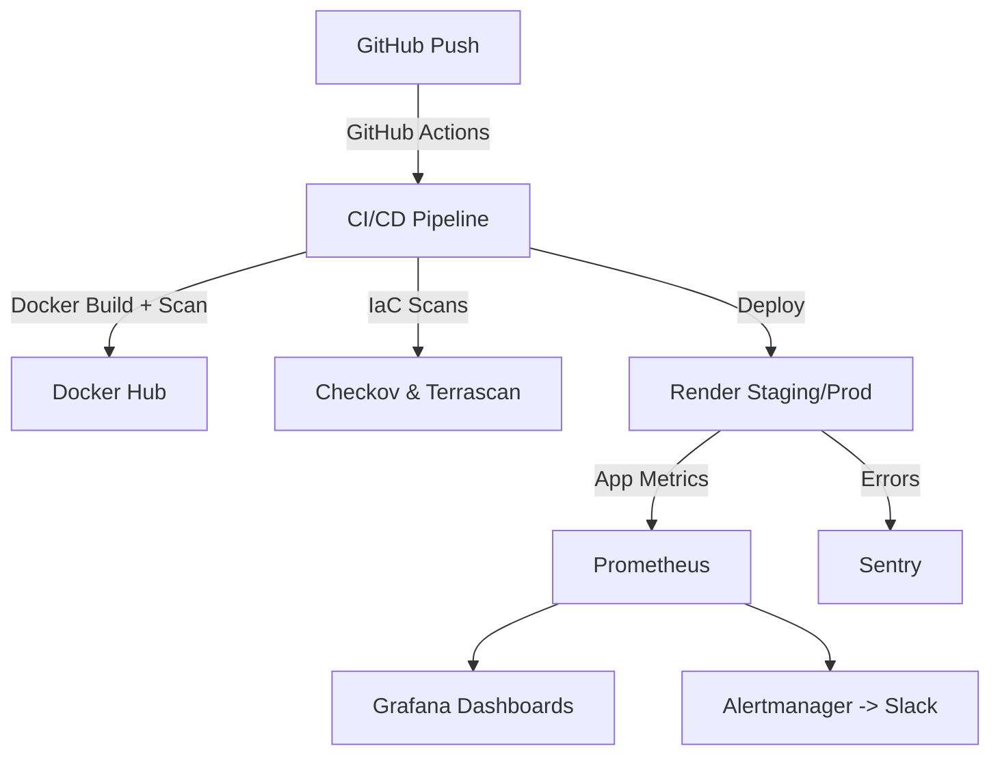
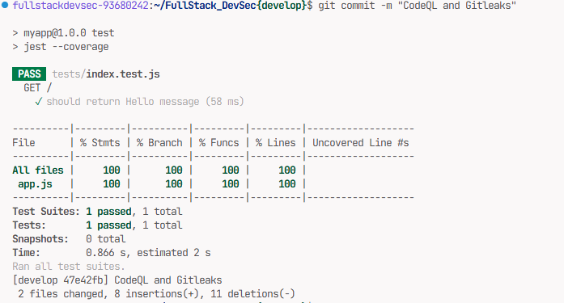
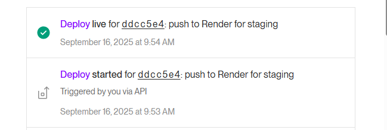
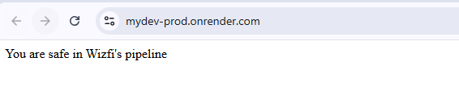
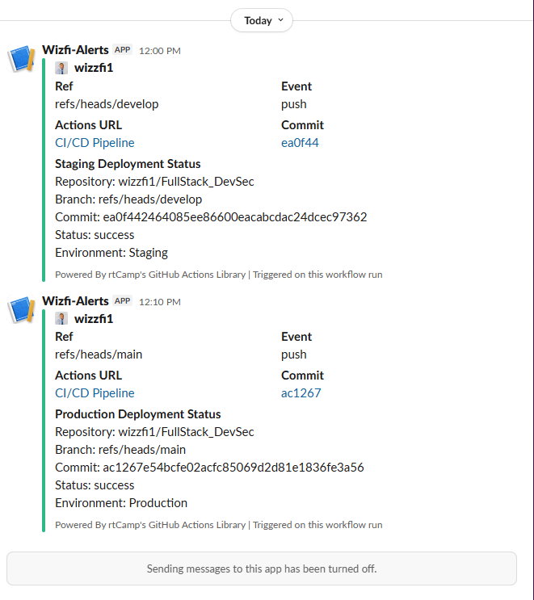

# 🚀 FullStack DevSecOps Demo

- **CI/CD Pipeline**: GitHub Actions with linting, testing, dependency audits, Docker builds, Trivy scans, Gitleaks, CodeQL, Checkov & Terrascan
- **Secure Containerization**: Hardened Dockerfiles with non-root users and HEALTHCHECK instructions
- **Runtime Security**: Gitleaks (secret scanning), CodeQL (static analysis), npm audit (dependency vulnerabilities)
- **Observability Stack**:
  - Prometheus for metrics collection
  - Grafana dashboards (CPU %, memory, HTTP request rates, error rate, latency)
  - Alertmanager + Slack for real-time alerts
  - Sentry for application-level error monitoring and release tracking
- **Environments**:
  - Staging: auto-deploy on `develop`
  - Production: auto-deploy on `main`
- **IaC Versioning**: Full `render.yaml` and Helm manifests for portability to Kubernetes (k3s, GKE, EKS)


## 🏗️ Architecture



# 🔄 CI/CD Workflow

## ✅ Lint & Test
- **ESLint** → code quality
- **Jest** → unit tests

## 🔒 Security Scans
- **npm audit** - dependency vulnerabilities
- **Trivy** - container vulnerabilities
- **Gitleaks** - secrets detection
- **CodeQL** - static analysis
- **Checkov + Terrascan** - IaC security

## 🐳 Build & Push
- Docker image pushed to Docker Hub with commit + latest tags

## 🚀 Deployments

### Staging (`develop` branch)
🔗 **Live Staging App**: [Your Staging URL Here]

### Production (`main` branch)
🔗 **Live Production App**: [Your Production URL Here]

## 🔔 Notifications
Slack messages for staging/prod deployments with build status:


---


🔗 **See live link here**: [Your Prometheus URL Here]


🔗 **See live link here**: [Your Grafana URL Here]


## Alertmanager
- Sends alerts to Slack via webhook
- Starter rules:
  - CPU > 80% for 2 minutes
  - Error rate > 5% over 5 minutes

## Sentry
- Captures unhandled exceptions
- Tied to GitHub Actions release versions
- Shows "Deployed to Staging/Prod" in release timeline


## 📸 Project in Action

### ✅ Lint & Tests Passing


### 🚀 Render Staging Deployment


🔗 [Staging App URL](docs/images/Staging-Url.png)

### 🌍 Production Deployment


### 🔔 Slack Notifications



All service images include:
- `HEALTHCHECK` instructions
- Non-root user execution
- Minimal base images (`node:18-alpine`, `alpine:3.20`, etc.)


# ☸️ Kubernetes (Future-Ready)

## Helm charts included for:
- `myapp` (Node.js/Express)
- Prometheus
- Grafana
- Alertmanager

## Secrets Management
Secrets managed via K8s Secret resources (Slack webhook, Grafana admin password).

## Supported Deployment Environments
- **Local dev**: k3s / kind
- **Cloud**: GKE, EKS, AKS

---

# ⚡ Quick Start (Render)

1. **Fork this repo**
2. **Set GitHub Actions secrets**:
   - `DOCKERHUB_USERNAME`, `DOCKERHUB_TOKEN`
   - `RENDER_API_KEY`, `RENDER_SERVICE_ID`, `RENDER_SERVICE_ID_PROD`
   - `SENTRY_AUTH_TOKEN`, `SENTRY_ORG`, `SENTRY_PROJECT`
   - `SLACK_WEBHOOK_URL`
3. **Push to `develop`** → staging deploy
4. **Merge to `main`** → production deploy

---


📂 Repository Structure
```

├── src/                    # Node.js app (Express + Sentry + Prometheus metrics)
├── infra/                  # Infra services
│   ├── prometheus/
│   ├── grafana/
│   └── alertmanager/
├── helm/                   # Helm charts for k8s migration
├── .github/workflows/      # CI/CD pipelines
├── render.yaml             # Render IaC config
└── Dockerfile              # App Dockerfile

🎯 Why This Matters


Interested in how I can bring end-to-end DevSecOps expertise to your team? Let’s connect!


[](https://github.com/wizzfi1/fullstack-devsecops-demo)
[](https://opensource.org/licenses/MIT)


</div>

